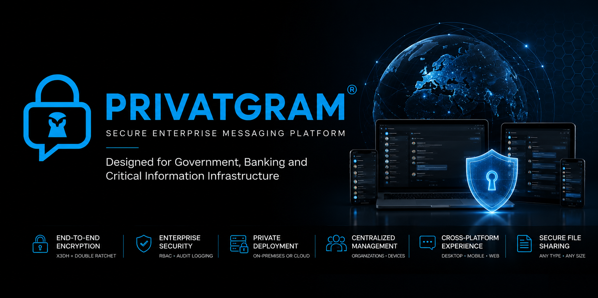
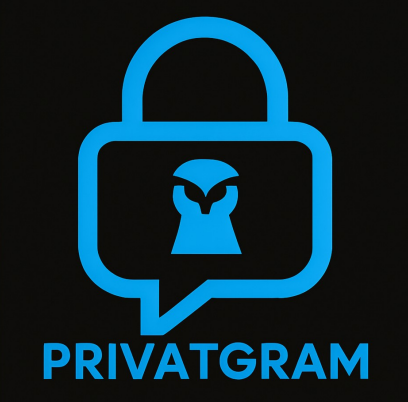
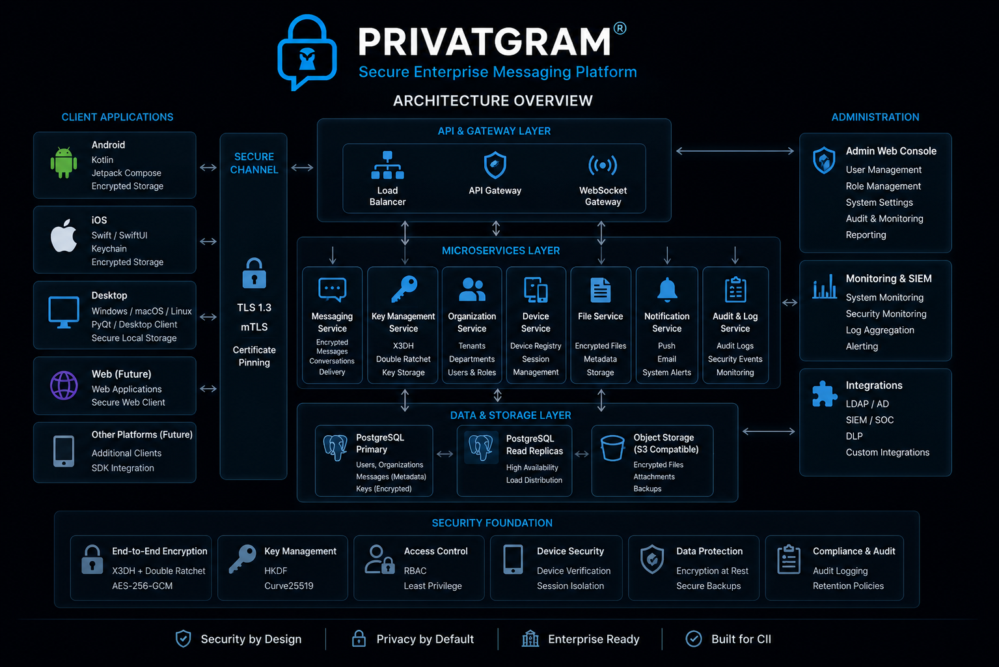
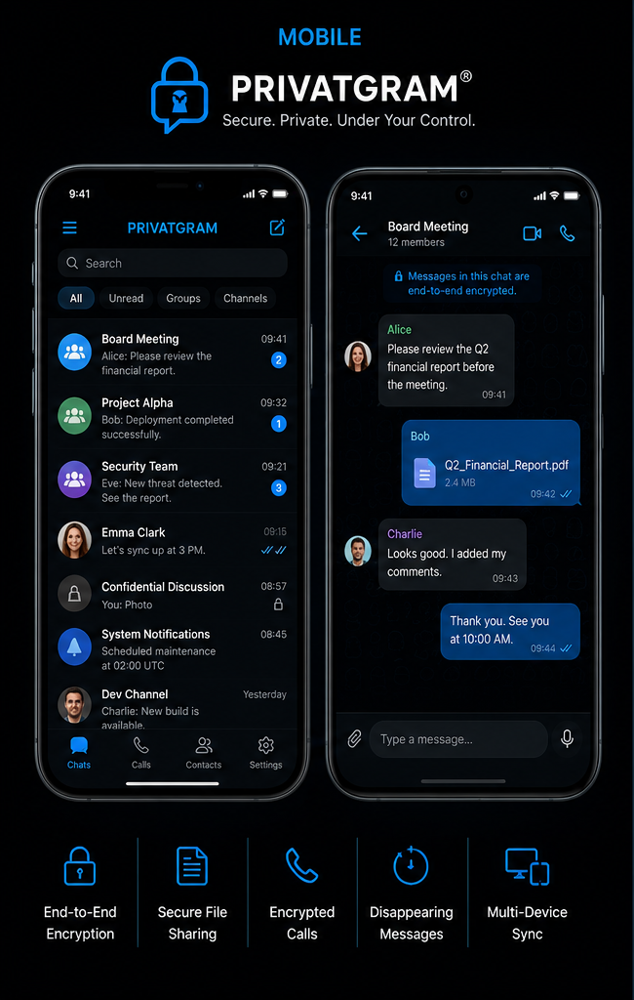
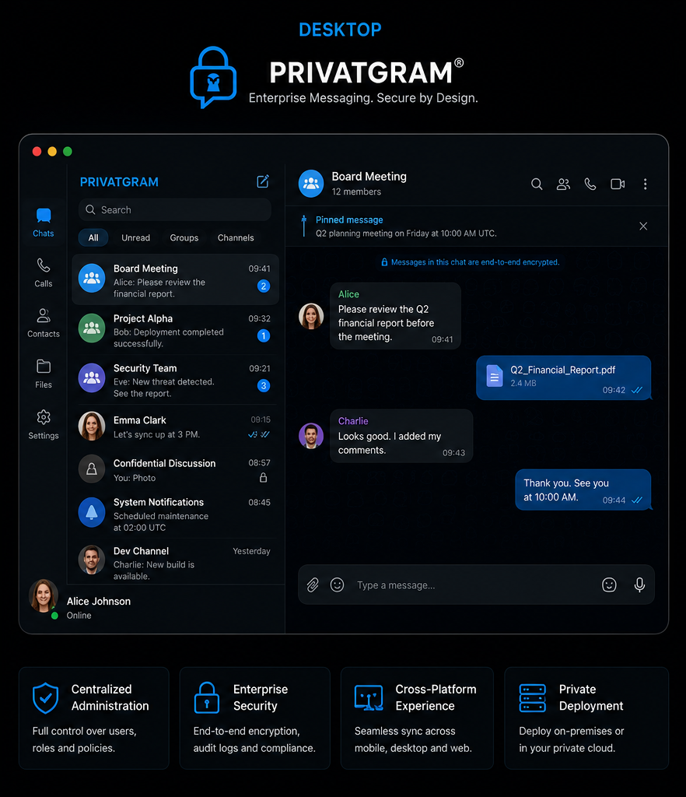

  

  

<h1 align="center">PRIVATGRAM®</h1>

## Secure Enterprise Messaging Platform

Designed for Government, Banking and Critical Information Infrastructure

<a href="https://privatgram.com">Website</a> •
<a href="https://privatgram.com/privacy.html">Privacy Policy</a>

---

# Official Documentation

Welcome to the official documentation repository of **PRIVATGRAM®**.

PRIVATGRAM is a secure enterprise messaging platform designed for organizations requiring confidential communications, centralized administration and complete control over their messaging infrastructure.

Unlike consumer messaging applications, PRIVATGRAM is built specifically for enterprise, government and regulated environments where information security, compliance and administrative control are essential.

This repository contains public documentation only.

The source code of PRIVATGRAM is proprietary.

---

# Product Overview

PRIVATGRAM provides organizations with:

- Secure Enterprise Messaging
- Centralized Administration
- Organization Management
- Role-Based Access Control (RBAC)
- Device Registration
- Session Isolation
- Secure File Transfer
- Multi-Platform Clients
- Audit Logging
- Private Infrastructure Deployment

The platform is designed for:

- Government Institutions
- Banks
- Financial Organizations
- Critical Information Infrastructure
- Large Enterprises
- Private Corporate Networks

---

# Security Architecture

PRIVATGRAM implements modern cryptographic standards and enterprise security principles.

Core technologies include:

- End-to-End Encryption
- X3DH Key Agreement
- Double Ratchet
- Curve25519
- HKDF
- AES-256-GCM
- TLS 1.3
- Certificate Pinning
- Secure Local Storage

Enterprise capabilities include:

- Role-Based Access Control
- Device Management
- Session Management
- Organization Administration
- Audit Logging
- Secure File Storage

---

# System Architecture

High-level architecture consists of:

- Desktop Client
- Android Client
- iOS Client
- REST API
- WebSocket Gateway
- Messaging Services
- Organization Services
- Device Management
- Notification Services
- PostgreSQL Database
- Secure Object Storage

---

# User Interface

## Mobile

---

## Desktop

---

# Supported Platforms

| Platform | Status |
|----------|--------|
| Windows | ✅ |
| Linux | ✅ |
| macOS | ✅ |
| Android | 🚧 In Development |
| iOS | 🚧 In Development |
| Web | 📋 Planned |

---

# Technology Stack

## Backend

- Python
- PostgreSQL
- REST API
- WebSocket

## Desktop

- PyQt

## Android

- Kotlin
- Jetpack Compose

## iOS

- Swift
- SwiftUI

## Security

- X3DH
- Double Ratchet
- Curve25519
- HKDF
- AES-256-GCM
- TLS 1.3

---

# Enterprise Capabilities

PRIVATGRAM enables organizations to centrally manage:

- Organizations
- Departments
- Users
- Roles
- Permissions
- Devices
- Active Sessions
- Security Policies
- Notifications
- Audit Logs

Deployment options:

- On-Premises
- Private Cloud
- Dedicated Enterprise Infrastructure

---

# Documentation

This repository contains official technical documentation.

Available documents:

- Product Overview
- System Architecture
- Security Model
- Deployment Guide
- Administrator Guide
- User Guide
- API Documentation
- FAQ
- Roadmap
- Whitepaper

---

# Development Status

Current project stage:

- ✅ Enterprise MVP
- ✅ Desktop Application
- ✅ Server Platform
- 🚧 Android Application
- 🚧 iOS Application
- 🚧 Enterprise Pilot Preparation

---

# Roadmap

## Version 1.x

- Secure Messaging
- File Sharing
- Enterprise Administration
- Mobile Applications

## Version 2.x

- Voice Calls
- Video Calls
- Screen Sharing
- Enterprise Federation

## Version 3.x

- AI Security Assistant
- SIEM Integration
- Threat Intelligence
- Compliance Automation

---

# Intellectual Property

PRIVATGRAM® is an original software project.

The project includes proprietary software components, technical documentation and registered intellectual property.

This repository contains documentation only.

No proprietary software source code is published.

---

# Contact

**Website**

https://privatgram.com

**Email**

info@privatgram.com

**Location**

Tashkent, Uzbekistan

---

# Research

**Developer**

Arthur Valiulin

Independent Researcher

Tashkent University of Information Technologies

**ORCID**

0000-0003-2883-7489

---

# License

Copyright © PRIVATGRAM®

All Rights Reserved.

The PRIVATGRAM software is proprietary.

The documentation published in this repository is provided for informational purposes only.

No permission is granted to copy, modify, redistribute or commercially use proprietary software components without prior written permission.

---

<b>Built in Uzbekistan 🇺🇿</b>

Security • Privacy • Enterprise

